# Sistemas de gestión empresarial: Una guía para la implementación y configuración

## Introducción

Entre todos los ERP que podemos encontrar, he elegido SAGE. En las próximas páginas vamos a ver un análisis de este sistema de gestión empresarial que está entre los más utilizados en el mundo de los negocios.

 

## Instalación

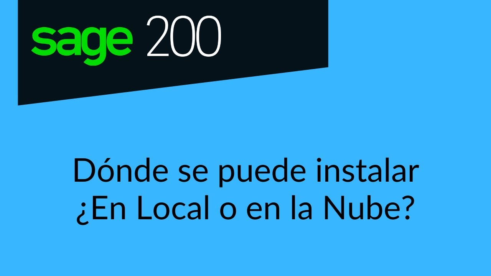

Sage presenta dos modalidades: una para instalar localmente y otra cuya ubicación está en la nube, en un servidor online, gestionado por Acens, empresa filial de Telefónica especializada en infraestructura y servicios cloud.

Para su uso local, se necesitan los siguientes requisitos técnicos:

    - Sistema operativo: Windows 10 o Windows 11 recomendando sus versiones profesional,        Enterprise o Ultimate.
    - Procesador: Intel® Core™ i3 o superior o gamas/rendimientos similares
    - Memoria RAM: 4 Gb.
    - Necesario Microsoft SQL Server en sus versiones 2014, 2016, 2017 o 2019 versión Express.
    - Disco duro libre: 10 Gb (Recomendado SSD)
    - Para el aprovechamiento de ciertas características del programa se recomienda: Microsoft Office 2010 o superior.
    - Red: Ethernet 100/1000 BT

Mientras que para su uso óptimo desde la nube, sólo se necesita una conexión de internet de más de 10 Mb y disponer de la capacidad que permita realizar una conexión remota.

 

## Adaptación y configuración

Aunque disponen de un servicio de software estandarizado más económico, el producto más interesante es su software personalizado.

¿Cómo lo define Sage? Pues esto es lo que nos dicen:

“Un  ERP personalizado al cien por cien es el desarrollo de un *software* de gestión específico para los requerimientos de la propia empresa, diseñado a su imagen y semejanza, teniendo en cuenta unas necesidades en concreto.

Cuando una empresa decide contratar el diseño de un *software* personalizado es obligatorio llevar a cabo unos pasos:

- Consultoría inicial donde se analizan las necesidades del cliente. 
¿Qué se quiere conseguir? ¿Qué necesidades se tienen? ¿Qué tipo de 
negocio es?
- Diseño y programación del *software*.
- Instalación y aplicación del *software*.
- Formación de la empresa.
- Periodo de correcciones para ajustar el *software* a la empresa.
- Seguimiento y control de su desarrollo.

En definitiva, es **un traje a medida informático que pertenecerá por completo a la empresa**,  incluyendo el código fuente.  Esto facilita el proceso de actualización  ante cambios o novedades y permite que se contrate a otro desarrollador, si fuera necesario, para implementarlos.”

 

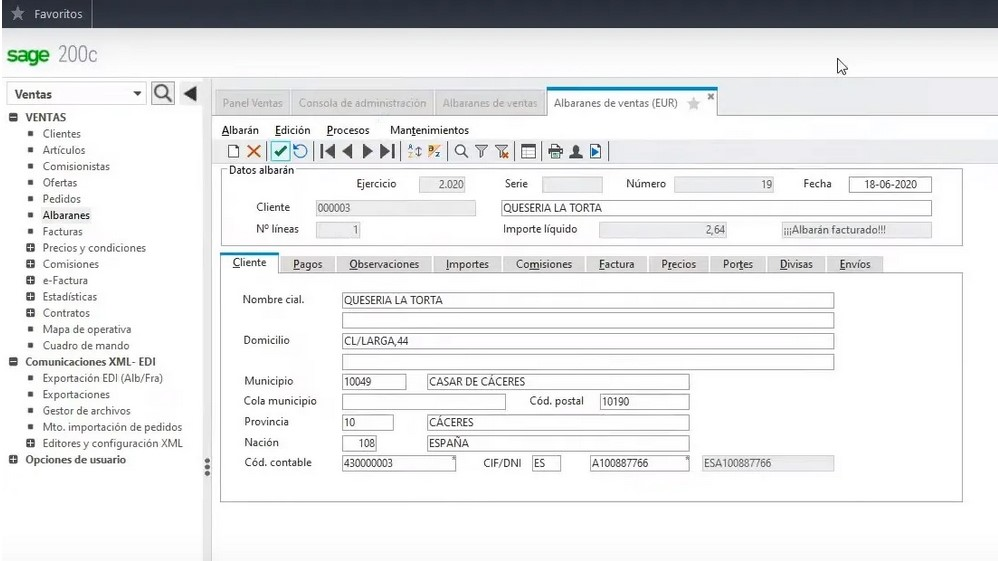

Como hemos comentado antes, también tienen un modelo de ERP basado en la nube, cuya implantación es mucho más económica, ya que no necesita una inversión muy grande en infraestructura

La adaptación de Sage a la empresa llega incluso a aportar soluciones de automatización de procesos rutinarios usando IA. Este es un elemento de enorme importancia que tenido mucho auge a raíz de la pandemia.

El ERP llega a estar tan integrado con la empresa que automatiza y simplifica montones de tareas administrativas, agilizando las gestiones y ahorrando costes.

 

## Integración de módulos

En cuanto a la integración de nuevos módulos, Sage ofrece el Sage 200 Advanced, una solución en la que se parte de una estructura básica a la que se puede añadir los módulos del ERP que pueda necesitar la empresa más adelante.

Algunos de ellos pueden ser Contabilidad y Finanzas, Gestión, Fabricación, y también una serie de módulos de gestión avanzada en Gestión de Clientes, Atención al Cliente y Marketing, Gestión de Proyectos, TPV, Gestión Laboral y de Recursos Humanos, y Business Intelligence.

 

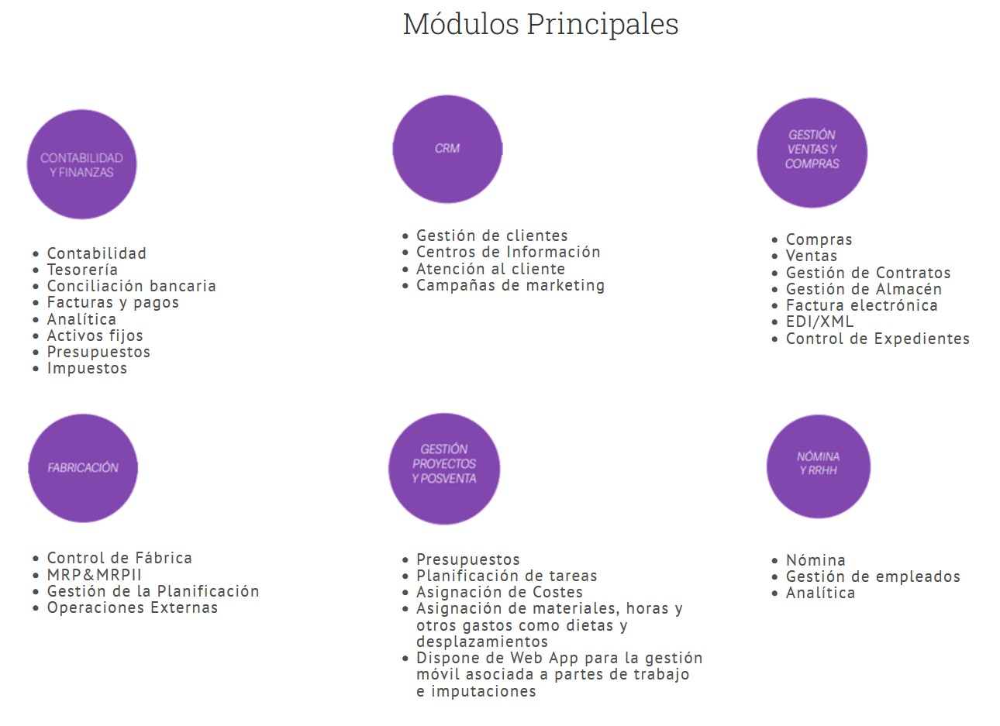

En cuanto a estos módulos, debemos añadir que muchos provienen empresas ajenas a Sage, pero totalmente homologados por este ERP.

 

## Elaboración de informes

En la empresa, la toma de decisiones va relacionada con encontrar las mejores soluciones en cada momento. Así como que sean lo más beneficiosas para la organización.

Para ello, necesitarás disponer de datos veraces  y de calidad, más que basarte sólo en corazonadas, intuiciones o experiencia.

 

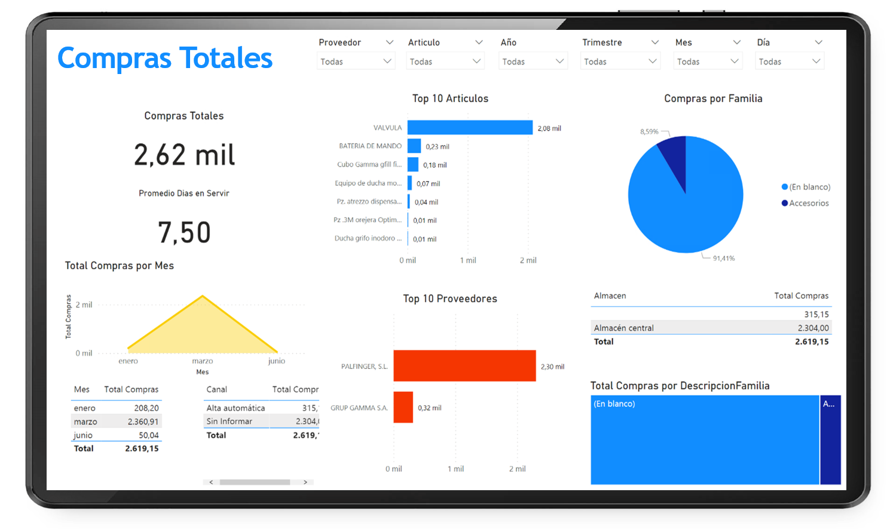

Un ERP bien integrado en la empresa es la herramienta perfecta para apoyarse en la toma de decisiones, puesto que dispone de la tecnología y procesos adecuados para recopilar datos, generar informes y sopesar objetivamente los pros y los contras. Es sin duda la clave para evitar tomar decisiones equivocadas.

## **Planificación, implantación y verificación de la seguridad**

Sage nos explica en su web todo lo relacionado con su política de seguridad.

 

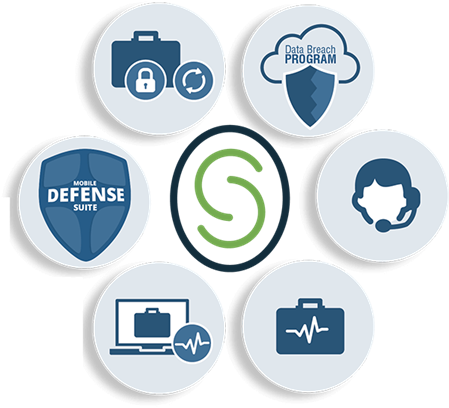

Seguimiento a los empleados que tienen acceso a los datos de los clientes, cifrado de datos, data centers a prueba de incendios, inundaciones, rayos, cortes de electricidad o similares, duplicidad de sus data centers, técnicas para garantizar un software seguro, realización de risk assessments de la seguridad y privacidad de sus proveedores, son algunas de las medidas que Sage toma para mantener una seguridad sin fugas y actualizada para cualquier ataque a sus datos.

 

## **Integración con aplicaciones ofimáticas**

En este caso hablaremos de la integración de Sage con Office 365 y las mejoras concretas de la misma.

 Nos encontraremos ante un todo-en-uno de Contabilidad y Trabajo en Equipo. Esto significa tener el  acceso al correo electrónico, a las videoconferencias, a la mensajería 
instantánea, a los documentos compartidos… de forma unificada. 

Además sin preocupaciones referentes a temas de almacenamiento y seguridad.

 

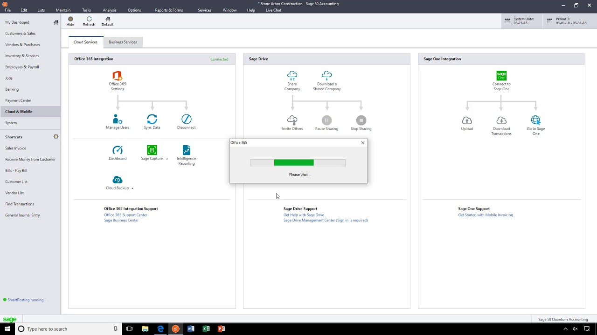

 

Algunas de sus características:

- Outlook-Sage Contact: No es necesario salir de Outlook para poder hacer consultas cobre contactos, balances, operaciones recientes… ¡Una completa integración!
- Automatización de copias de seguridad: Las copias online de Sage 50c permiten a los usuarios destinar su tiempo a cuestiones más productivas, dado que se realizan de forma automática.
- Agenda: Permite visualizar los eventos del calendario y la agenda de Outlook sin salir de Sage 50c, sin necesidad de estar constantemente sincronizando calendarios distintos.
- Comunicación total: Desde el propio Sage 50c se puede usar Skype para estar plenamente conectado con el equipo y los clientes, sin necesidad de salir del entorno y con un solo click.
- Conexión OneDrive y Sage 200cloud: OneDrive es un servicio seguro de alojamiento de archivos en línea (Office 365) que permite compartirlos y colaborar con otras personas en cualquier momento utilizando cualquier dispositivo. El ERP Sage 200cloud se integra con este espacio para tener acceso continuo a las informaciones y documentos que necesites. Es posible trabajar en un espacio individual o compartido con otras personas.

 

## **Exportación de información**

La exportación de datos a Excel es una tarea sencilla con Sage Despachos for Life.

Tenemos 2 opciones para realizar la exportación:

1. Haciendo botón derecho del ratón situados sobre listado y seleccionando la opción de **«Gestor de Exportación a Excel».**
2. En la parte derecha pulsando sobre el **logo** de **Excel.**

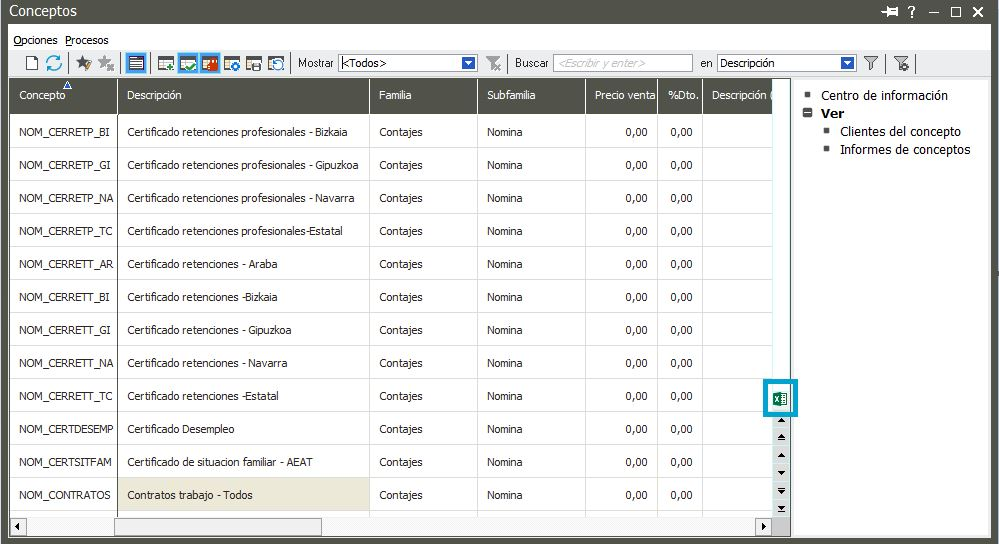

Después aparece un cuadro de diálogo:

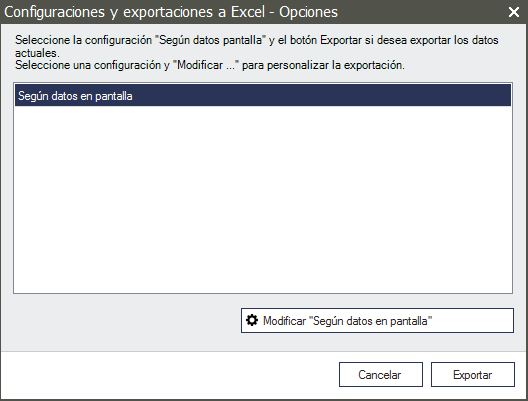

Aquí tenemos varias opciones:

- Exportar: Nos creará la hoja de cálculo con todos los campos que tengamos en el listado.
- Cancelar: No realizará ningún proceso.
- Modificar «Según datos en Pantalla»: definiremos qué campos necesitamos «llevar» al Excel. Podremos modificar el nombre del campo, la ordenación (ASC/DESC), saltos de hoja y totales, para los campos numéricos.

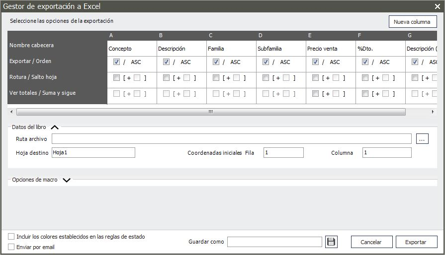

Aceptaremos, y una vez que pulsemos sobre «Exportar» nos generará el Excel.

Si nos interesa guardar esta exportación, para utilizarla posteriormente, le daremos un nombre y pulsaremos en Guardar como para grabarlo.

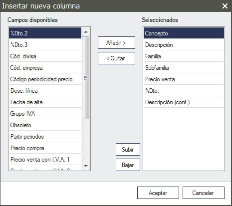

Para ejecutar la exportación guardada, simplemente accederemos al Gestor de Exportación a Excel, seleccionaremos el nombre y pulsaremos sobre el botón Exportar. Si necesitamos modificarla, podemos hacerlo desde Modificar.
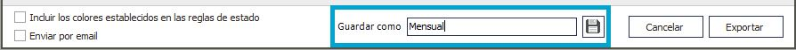

También nos permite exportar las reglas de estado y enviar el Excel por correo electrónico, en el caso de que lo tengamos marcado.
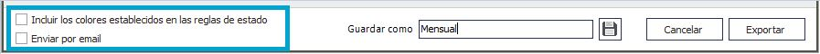

 

En cuanto a la exportación a XML, podremos realizarla con Sage Despachos Connected.

Nos permite realizar una Exportación en formato XML de los Datos contables de la empresa como pueden ser: Plan de cuentas, Clientes/Proveedores, Movimientos contables, Canales, Presupuestos…

Para realizar la Exportación de los datos contables de una empresa (o  varias) en formato XML, accederemos al módulo de Configuración, menú Configuración - Importación/Exportación - Datos contables XML - Exportar XML.

Algunas instantáneas de proceso de exportación a XML, que nos permite seleccionar qué datos queremos incluir en nuestro documento XML y de qué manera.

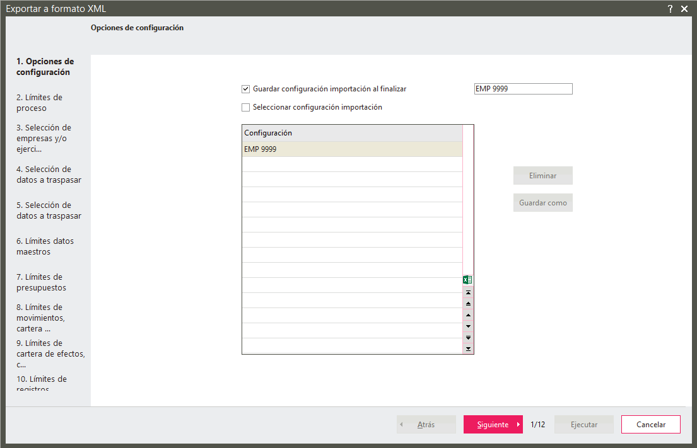

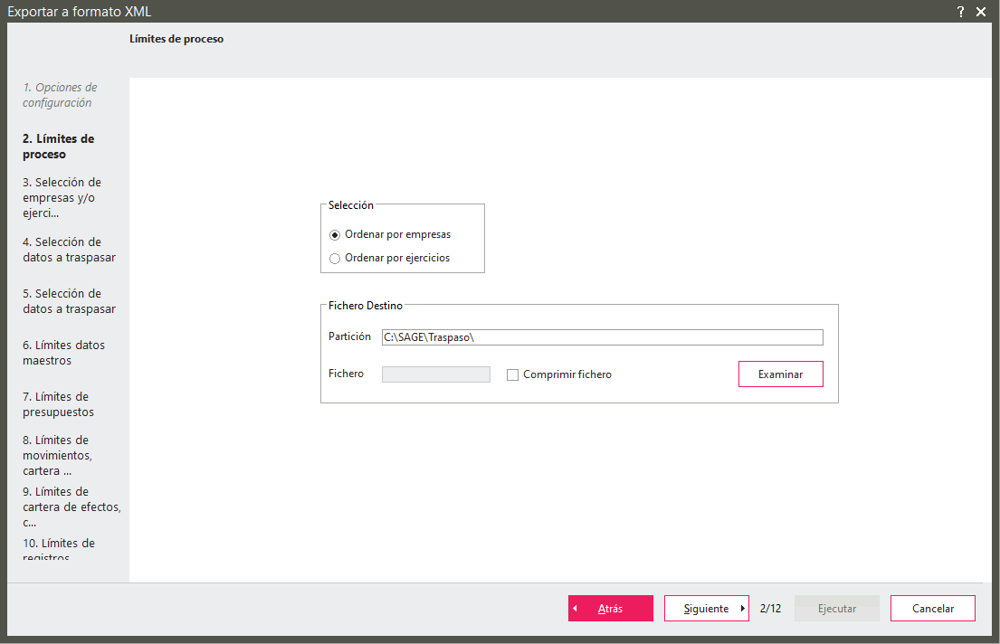

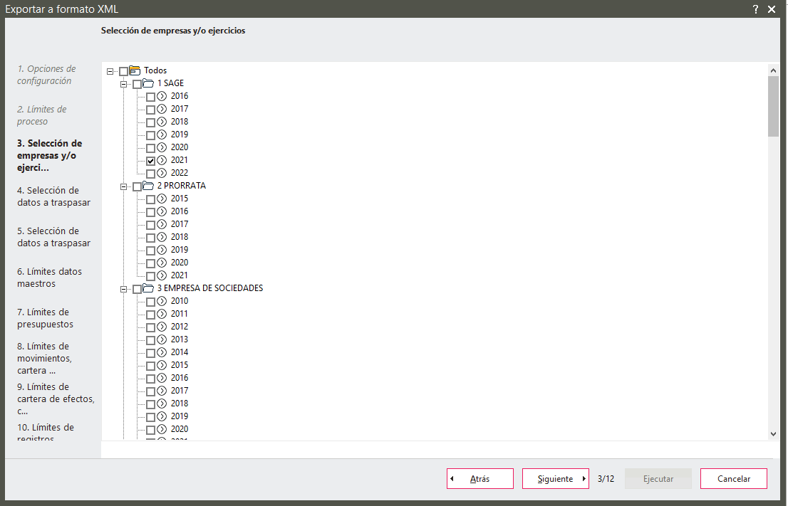

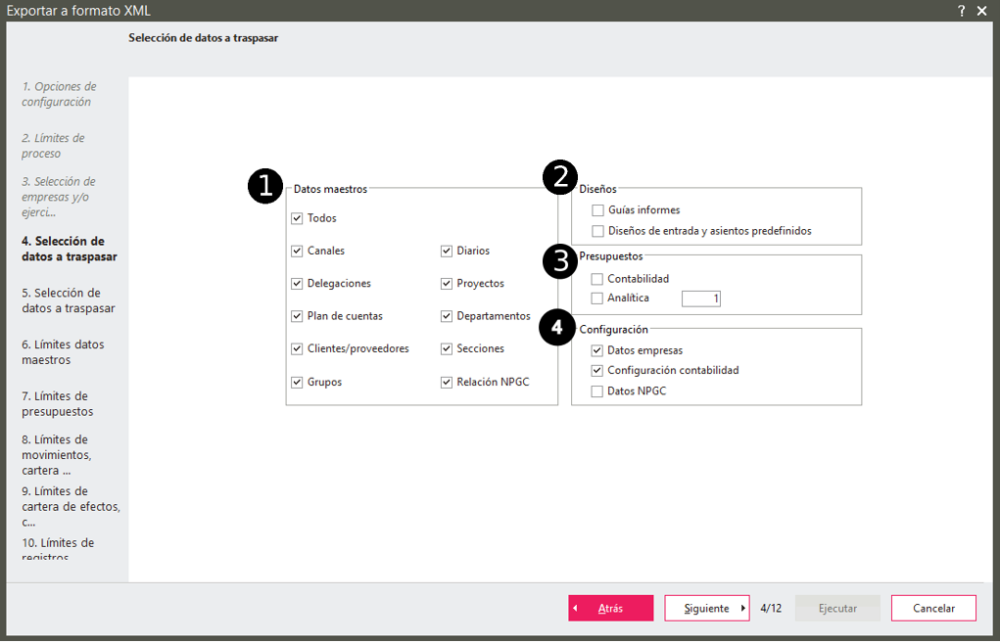

 

## Conclusión

Tras esta visión general de Sage y sus posibilidades, podemos afirmar que los ERP son herramientas indispensable en la actualidad para cualquier empresa que se precie de ser competitiva. 

Su implementación y configuración no es un proceso complicado en absoluto, ya que es muy intuitivo y además se cuenta con asistencia continua para resolver cualquier problema de configuración. 

Además, la flexibilidad que proporciona la posibilidad de ir añadiendo módulos que vayan gestionando nuevas tareas y objetivos que aparezcan en la empresa a medida que vaya creciendo, convierten a los ERP en herramientas flexibles y dinámicas, que se adaptan con facilidad a las necesidades de cualquier empresa

 

## Estadísticas

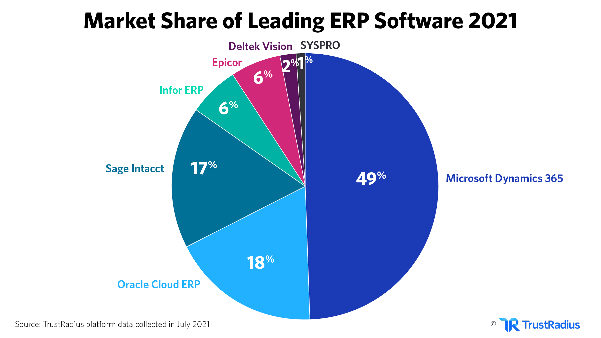

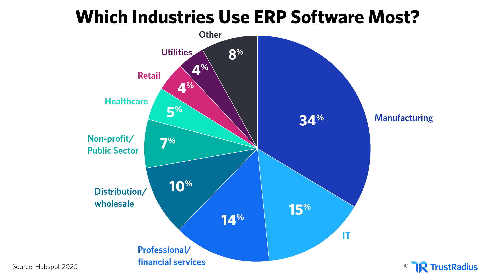

 

## Bibliografía

https://www.sage.com/es-es/erp/

https://www.sage.com/es-es/

https://soporte.sage.es/sage-despachos-for-life-2/2017/04/exportacion-a-excel-en-sage-despachos-for-life/

https://www.ontek.net/integracion-sage-50c-office-365/

https://www.orbit.es/integracion-sage-200cloud-con-office-365/

https://www.sage.com/es-es/sobre-sage/sage-privacidad/

https://www.opentix.es/como-personalizar-sage-200-paso-a-paso/

https://support.na.sage.com/selfservice/viewContent.do?externalId=112157&sliceId=1

https://jsm-consultoria-tecnologica.es/sage-200-advanced-software-gestion-pymes/
