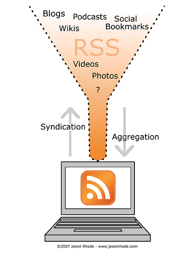
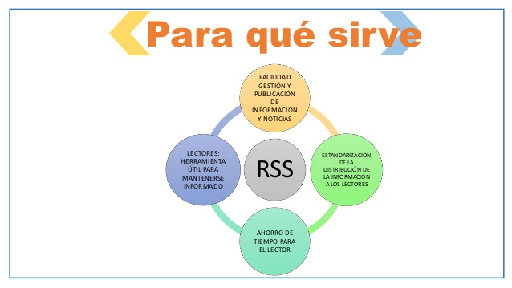
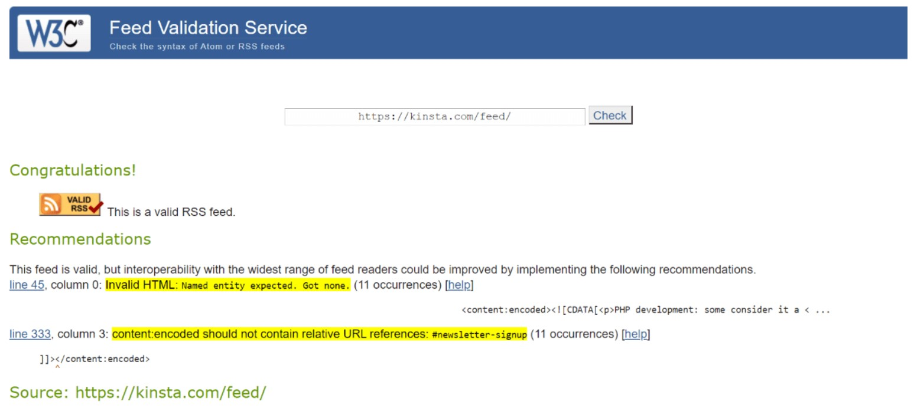
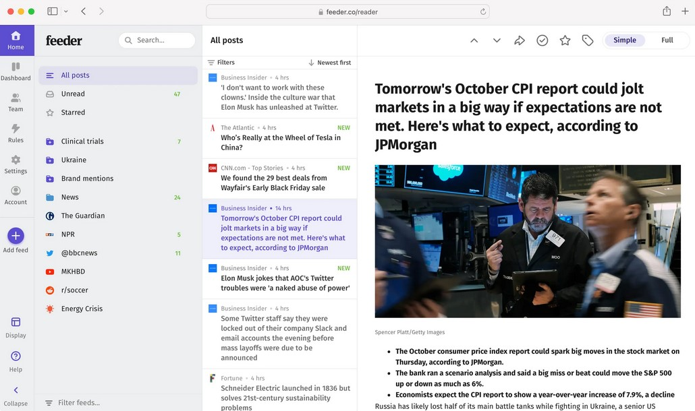

# SINDICACIÓN DE CONTENIDOS RSS

## 1. Introducción: 

 
 
La sindicación de contenidos es el proceso de distribución de información y contenidos digitales a través de una fuente centralizada a múltiples plataformas y usuarios. Este proceso permite que los usuarios puedan acceder a una gran cantidad de información en diferentes formatos de manera más eficiente y automatizada.

Es cada vez más relevante en la era digital, donde la cantidad de información disponible en línea es abrumadora. Facilita la gestión y distribución de información en diferentes formatos, como noticias, blogs, videos, audios, entre otros.

Además, permite la personalización y filtrado de contenidos por parte del usuario, lo que le permite recibir solo la información que le interesa. También reduce el tiempo y el esfuerzo necesarios para publicar y actualizar contenidos en múltiples plataformas, lo que ahorra recursos y mejora la eficiencia.

 

 

## 2. Ventajas de utilizar RSS como formato de sindicación de contenidos:

 

    - Facilita la distribución de información de manera eficiente y automatizada.
    - Permite la personalización y filtrado de contenidos por parte del usuario.
    - Aumenta la visibilidad y alcance de los contenidos publicados.
    - Reduce el tiempo y esfuerzo necesario para publicar y actualizar contenidos en múltiples plataformas.

 

 

## 3. Ámbitos de aplicación de RSS:

 

    - Publicación de noticias y actualizaciones en sitios web y blogs.
    - Distribución de contenidos multimedia, como podcast y videos.
    - Actualización de productos y servicios en tiendas online.
    - Comunicación interna en empresas y organizaciones.
    - Publicación de ofertas de empleo y oportunidades de negocios.

 

 

## 4. Estructura de los canales de contenidos en RSS:

 

**RSS**: Es el elemento raíz que define el formato de RSS utilizado.

 

**CANAL**

**Channel**: Es el contenedor principal del canal de contenidos, que contiene toda la información relacionada con el contenido del canal.

**Title**: Es el título del canal de contenidos, que identifica el contenido que se distribuye.

**Link**: Es la URL del sitio web asociado al canal de contenidos.

**Description**: Es una breve descripción del contenido del canal de contenidos.

**LastBuildDate**: Es la fecha en que se generó el canal de contenidos por última vez.

 

**ELEMENTO DEL CANAL**

**Item**: Es el contenedor que contiene la información sobre un elemento individual del contenido del canal, como un artículo o una publicación.

**Title**: Es el título del elemento individual del contenido del canal.

**Link**: Es la URL del elemento individual del contenido del canal.

**Description**: Es una breve descripción del elemento individual del contenido del canal.

**PubDate**: Es la fecha de publicación del elemento individual del contenido del canal.

 

 

## 5. Tecnologías utilizadas para crear canales de contenidos en RSS:

 

**Lenguajes de marcas**: El formato RSS se basa en lenguajes de marcas como XML o HTML, por lo que se pueden utilizar herramientas de creación de XML o HTML para generar el código del canal de contenidos en RSS.

**Editores de texto**: Muchos editores de texto, como Notepad++, Sublime Text, o Visual Studio Code, tienen soporte para lenguajes de marcas como XML y se pueden utilizar para crear canales de contenidos en RSS.

**Generadores de RSS**: Existen diversas herramientas y servicios en línea que permiten la creación de canales de contenidos en RSS sin necesidad de escribir código. Por ejemplo FeedBurner, Feedity, o Feed43.

**Plataformas de gestión de contenidos (CMS)**: Algunos CMS, como WordPress, Joomla, o Drupal, tienen la capacidad de crear y administrar canales de contenidos en RSS de manera nativa.

 

 

## 6. Validación de los canales de contenidos en RSS:

 

La validación de los canales de contenidos en RSS es un proceso importante para asegurar que el canal está bien estructurado y cumple con los estándares RSS.  
Puede realizarse utilizando herramientas en línea o software especializado que compruebe si el código RSS cumple con los requisitos establecidos.

Entre los errores más comunes que pueden surgir al validar un canal de contenidos en RSS se encuentran:

1. **Errores de sintaxis**: El código del canal de contenidos en RSS no sigue las reglas de sintaxis establecidas por el estándar RSS, lo que impide su correcta lectura y procesamiento.

2. **Errores de contenido**: Los elementos del canal de contenidos no están completos o contienen información incorrecta, lo que puede afectar la legibilidad y distribución del contenido.

3. **Errores de enlace**: Los enlaces que se utilizan en el canal de contenidos no son válidos o no funcionan, lo que puede impedir el acceso al contenido y afectar la experiencia del usuario.

Para corregir estos errores, es importante revisar el código del canal de contenidos y asegurarse de que se siguen las reglas de sintaxis y se utilizan los elementos y atributos adecuados. También se pueden utilizar herramientas en línea o software especializado para la validación automática del canal.

Es importante recordar que la validación de los canales de contenidos en RSS es un paso crucial para asegurar que el contenido se distribuya correctamente y llegue a la audiencia deseada.

 

 

## 7. Directorios de canales de contenidos en RSS:

 

Son sitios web que se dedican a recopilar y organizar canales de contenidos en RSS para que los usuarios puedan descubrir y suscribirse a ellos de manera fácil y rápida.  

Se organizan por tema, categoría o interés, lo que permite a los usuarios encontrar canales de contenidos en RSS relacionados con sus áreas de interés.

Existen muchos actualmente, algunos son gratuitos, en otros hay que pagar para incluir canales de contenidos en su lista. Por ejemplo, Feedly, RSS.com, y DMOZ.

Incluir un canal de contenidos en un directorio de RSS puede ser beneficioso para los creadores de contenido ya que les permite llegar a una audiencia más amplia y aumentar la visibilidad de su contenido. Y para los usuarios pueden ser una forma conveniente de descubrir nuevos contenidos y mantenerse actualizados sobre temas de su interés.

Estar en uno de estos directorios no garantiza automáticamente un aumento en el tráfico o en la audiencia. Es necesario crear contenido de calidad y promocionar el canal de contenidos de manera efectiva para atraer a más suscriptores.

 

 

## 8. Agregación de contenidos mediante RSS:

 

Es un proceso mediante el cual se pueden recopilar y consolidar contenidos de diferentes fuentes en un único lugar utilizando canales de contenidos en RSS. Esto permite a los usuarios mantenerse actualizados sobre temas de su interés sin tener que visitar varios sitios web diferentes.

Existen diferentes herramientas que se pueden utilizar para ello, incluyendo lectores de RSS en línea, aplicaciones de escritorio y extensiones de navegadores web. Cuando usas una de ellas, se pueden recibir las actualizaciones de ese canal de contenidos en un solo lugar.

Por ejemplo, si alguien está interesado en seguir las últimas noticias en comics, podría suscribirse a varios canales de contenidos en RSS de diferentes sitios web de noticias sobre comics utilizando un lector de RSS en línea. Cada vez que se publique una nueva noticia en cualquiera de los canales de contenidos a los que se suscribió, el lector de RSS mostrará esa noticia en una lista de actualizaciones.

Agregar de contenidos mediante RSS es una forma eficiente de mantenerse actualizado sobre temas de interés y puede ahorrar tiempo y esfuerzo al evitar la necesidad de visitar varios sitios web diferentes. Además, los usuarios tienen mayor control sobre el tipo de contenido que reciben, ya que solo reciben actualizaciones de los canales de contenidos a los que se han suscrito.

 

 

## 9. Conclusión:

 

La sindicación de contenidos se ha convertido en una herramienta indispensable para recabar información de la web de manera precisa y rápida.

Al usuario, le permite estar al tanto de lo que le interesa y no perder tiempo navegando sin rumbo.

Al creador de contenidos, le facilita la tarea de ofrecer sus contenidos directamente a un público que sabe que está interesado en él.

Se convierte en nuestra brújula cuando navegamos por este océano inmenso de información en el que se ha convertido la World Wide Web en la actualidad.

 

 

# FIN

